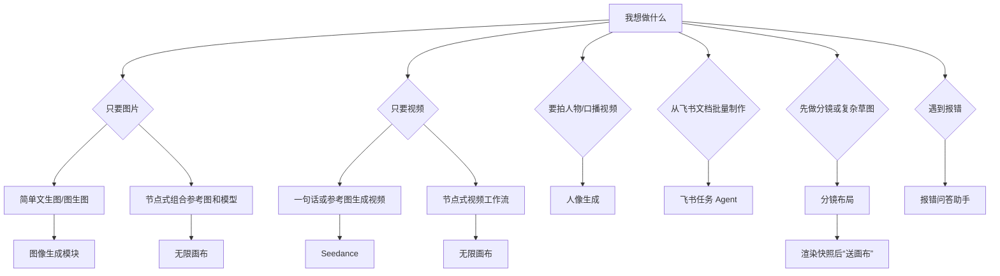

# AI 生成聚合平台使用手册（新人上手版）

> 文档版本：2026-09-01  
> 适用对象：公司内新入职同事、第一次使用平台的同事、需要快速找到对应工具的同学  
> 维护方式：平台功能变更时同步更新本文件；访问地址和具体 IP 不写死，以启动横幅或管理员通知为准。

## 1. 这份手册解决什么问题

平台把图片生成、视频生成、人像生成、分镜预演、无限画布、飞书批量任务、报错问答、密钥管理、历史记录和统计管理整合在同一个入口。

本手册按使用场景组织，先回答“我要做什么”，再回答“去哪里点、填什么、结果在哪里、失败怎么查”。

如果你是第一次使用，建议先完成第 2 节“五分钟上手”，再按需查看第 4 节之后的模块说明。

## 2. 五分钟上手

### 2.1 打开平台

1. 向管理员索取当前平台地址。当前地址通常形如：

   ```text
   https://<局域网IP>:9090
   ```

   地址里的 IP 可能每周变化，以管理员通知、启动日卡或页面顶部横幅为准。

2. 浏览器首次打开可能提示“连接不是私密连接”或“证书不受信任”。

   这是公司局域网自签名证书导致的，不是网络故障。选择“高级 → 继续前往”即可。

3. 登录账号。

   - 已有账号：直接输入用户名和密码。
   - 没有账号：如果管理员开启了公开注册，在登录页点击“注册”；否则请联系管理员在“统计与管理”页创建账号。

4. 登录后，顶部会显示当前用户名。看到右上角名称旁边有“★”时，说明你是管理员。

### 2.2 第一次使用建议按这个顺序做

1. 先在“密钥库”添加自己的 API Key。
2. 进入“图像生成模块”，用一句简单提示词生成一张图，跑通基本流程。
3. 进入“Seedance”，用同一句提示词生成一个 4 到 5 秒的短视频，了解视频任务需要等待更久。
4. 打开“历史记录”，确认刚才的图片和视频都能在这里看到并下载。
5. 有报错时，把报错文字或截图贴到“报错问答助手”。

### 2.3 两个最重要的全局入口

- **左侧导航栏**：切换各个工具模块。
- **右侧“导演台”**：随时可以优化提示词、扩写提示词、生成负面词，或直接快速文生图。点右侧边缘的箭头可折叠或展开。

## 3. 平台全景图

### 3.1 当前板块

| 顶部入口 | 一句话用途 | 主要产物 | 通常谁来用 |
|---|---|---|---|
| Seedance | 文生视频、图生视频、首尾帧视频、视频延长/编辑 | MP4 等视频 | 视频/创意同事 |
| 图像生成模块 | 文生图、多参考图编辑、批量出图 | PNG/JPG/WebP 等图片 | 设计/创意同事 |
| 飞书任务 Agent | 从飞书文档或多维表格拆任务，人工审批后批量生成并回写飞书 | 图片、视频、飞书交付 | 项目协调、批量生产 |
| Dreamina | 即梦账号的图片和视频生成 | 图片、视频 | 需要即梦模型能力的同事 |
| 人像生成 | 虚拟人像素材管理和人像视频生成 | 人像视频 | 口播、人物视频团队 |
| 无限画布 | 用节点和连线组织参考图、提示词、模型和结果 | 图片、视频、可保存画布项目 | 复杂创意和批量创意迭代 |
| 分镜布局 | 3D 简易人物/道具摆放、机位预演、镜头快照标注 | PNG 快照、镜头项目 | 分镜、导演、视频策划 |
| 密钥库 | 保存并复制个人 API Key | 无产出 | 所有用户 |
| 报错问答助手 | 用知识库和源码定位报错 | 文本答案 | 所有用户 |
| 历史记录 | 跨应用查看自己的图片、视频和 Agent 任务 | 下载、参数回看 | 所有用户 |
| 统计 | 查看用量；管理员维护用户、共用 Key、飞书日报 | 报表、CSV | 所有人可见，管理操作仅管理员 |

右侧还有常驻的“导演台”，用于提示词处理和快速文生图。

### 3.2 选模块决策图



## 4. 平台通用操作

### 4.1 左侧导航栏

- 桌面端：左侧导航栏按“创作区 / 协作与查询 / 个人与管理”分组，点击即可切换。
- 移动端：顶部使用“当前应用”下拉框切换，已包含分镜布局入口。

分镜布局依赖 WebGL2 和 3D 视口，建议优先在桌面浏览器使用。

### 4.2 密钥库

位置：顶部“密钥库”。

密钥库只负责**保存和复制**，不会自动把密钥写入 Seedance 或图像生成模块。

推荐操作：

1. 添加密钥，名称建议写清楚，例如“T8Star主力”“火山方舟个人Key”。
2. 供应商按实际来源选择。
3. 进入 Seedance 或图像生成模块后，把对应的 Key 粘贴到左侧“API Key”输入框。

注意：

- 密钥仅本人可见。
- 不要截图、发群或在代码中提交密钥。
- 人像生成使用管理员配置的公司共用 Key，普通用户不需要填。
- 无限画布沿用 Seedance / 图像生成模块的模型和密钥配置。

### 4.3 历史记录

位置：顶部“历史记录”。

可用过滤条件：

- 全部 / 图片 / 视频 / Agent
- 全部状态 / 成功 / 失败 / 生成中
- 近 7 天 / 30 天 / 90 天
- 搜索提示词或任务编号

点击卡片可查看：

- 使用人、应用、模型、任务编号
- 提交时间、完成时间、耗时
- 原始请求参数
- 返回状态、错误信息
- 所有产出文件并逐个下载

建议：重要结果生成后尽快下载，或确认其已同步到自己的飞书“XX的AI产出”表格。

### 4.4 产出保存和清理

平台运行在服务器上，产出默认统一保存在服务端：

```text
<模块>/outputs/<用户名>/<日期>/
```

浏览器中“下载”会拿到文件副本，不影响服务器原件。

服务器每天会自动清理超过 14 天的旧产物：

- 已同步到飞书多维表格的文件可能直接删除；
- 未同步的文件会先移入回收站，而不是立即销毁。

因此不要只依赖服务器文件永久存在。重要素材请：

1. 立即下载到本地；
2. 或确认“飞书输出同步”已经把你的产出搬进飞书多维表格。

### 4.5 服务重启对任务的影响

部分模块的运行中任务是内存态。服务器重启时，正在生成的任务可能中断。

遇到“任务已失效”“服务可能重启过”的提示：

1. 先到“历史记录”确认是否有结果；
2. 没有结果就重新提交；
3. 重复失败时到“报错问答助手”查询。

### 4.6 自签名证书与下载

平台已经处理了自签名证书下的大部分下载问题。如果浏览器提示下载失败：

1. 使用页面内的“下载”按钮，不要复制视频链接另开标签页；
2. 检查本地浏览器是否阻止了自动下载；
3. 大文件下载可能较慢，请等待底部或页面上的下载进度。

## 5. 导演台

位置：页面最右侧，常驻可折叠。

### 5.1 功能列表

| Skill | 用途 | 是否调用付费模型 |
|---|---|---|
| 提示词优化 | 保留原意，补齐主体、场景、光影、风格，输出 80–200 字 | 调用提示词模型 |
| 提示词扩写 | 把一句话扩写成分镜式描述 | 调用提示词模型 |
| 结构化提示词 | 输出 LangGPT 的 Role/Profile/Rules/Workflow/Initialization | 调用提示词模型 |
| 工业模板 | 从模板库随机或按分类取一条 | 只读本地词库 |
| 风格参考 | 从风格库选择风格片段 | 只读本地词库 |
| 场景灵感 | 从灵感库换一条参考 | 只读本地词库 |
| 负面词生成 | 输出常用负面词集合 | 只读本地词库 |
| 文生图 | 直接按比例、清晰度、数量生成图片 | 调用图片模型 |

### 5.2 推荐用法

1. 先用“提示词优化”或“提示词扩写”处理一句粗糙想法。
2. 点击“复制”把结果带走。
3. 点击“填入文生图”直接进入导演台文生图模式。
4. 生成结果可下载，也可把最终提示词复制到 Seedance 或图像生成模块继续迭代。

## 6. 图像生成模块

### 6.1 这个模块适合什么

- 文生图：只给提示词，不出参考图。
- 图生图：给 1 张到多张参考图，修改人物、构图、风格或保留某些元素。
- 批量出图：设置重复次数，一次产出多张候选。
- 多参考图组合：例如角色图 + 场景图 + 风格图一起作为参考。

### 6.2 标准操作流程

1. 顶部切换到“图像生成模块”。
2. 左侧“接口”选择供应商、Base URL，并填入 API Key。
3. 选择模式：

   - `img2img`：需要参考图。
   - `text2img`：不需要参考图。

4. 选择模型、比例、尺寸和返回格式。
5. 在“Prompt”中输入要求。
6. 图生图时在“参考图”区上传图片。
7. 设置重复次数、并发数。
8. 点击“开始生成”。
9. 在“任务”区查看进度和结果；也可到“活动”区查看调用记录和恢复参数。

### 6.3 关键参数

| 参数 | 建议 |
|---|---|
| 模式 | 无参考图用 `text2img`；有参考图用 `img2img` |
| 比例 | 短视频平台常用 `9:16`；横屏常用 `16:9`；设计常用 `1:1`、`4:3` |
| 尺寸 | 正式交付优先 `2K`；测试速度优先 `1K` 或 `1.5K` |
| Seed | 想复现同一张图时固定 Seed；否则留空或开启 `seed +1` |
| 重复次数 | 想一次挑图可设为 2–5，但会增加调用量和成本 |
| 并发数 | 网络稳定时可 2–3；不确定时先保持 1 |

### 6.4 参考图数量

- 不同供应商和模型支持的参考图数量不同。
- T8Star / Chiyun 默认最多 14 张。
- 火山 Seedream 最多 10 张。
- 页面会在上传区显示当前模型最多支持的张数。

### 6.5 多标签工作区

图像生成模块顶部有类似浏览器标签的“工作区”：

- 每个标签有独立提示词、参数和任务列表。
- 适合同时做两个不同主题，互不污染。
- 最后一个标签不能关闭。

### 6.6 常见问题

- “API Key 无效”：检查是否粘贴正确，以及该 Key 是否有可用额度。
- “当前模型最多支持 N 张参考图”：减少参考图，或切换模型。
- 批量任务部分失败：开启“跳过错误”可让其他任务继续，但可能产生额外调用成本。
- Seedream 5.0 Pro 官方接口不支持 Seed，页面会自动停用相关输入。

## 7. Seedance 视频生成

### 7.1 这个模块适合什么

- 文生视频。
- 用参考图生成视频。
- 用首帧和尾帧生成视频。
- 用参考视频、参考音频做动作或声音参考。
- 视频延长、视频编辑。

### 7.2 标准操作流程

1. 顶部切换到“Seedance”。
2. 左侧“接口”选择供应商并填入 API Key。
3. 选择模型。
4. 选择任务类型：

   - “参考生视频（默认）”：常规图片/视频生成。
   - “视频延长”：需提供待延长视频。
   - “视频编辑”：需提供待编辑视频，且按提示词删除、修改、增加内容。

5. 填写 Prompt。
6. 根据需要上传：

   - 首帧
   - 尾帧
   - 参考图
   - 参考视频
   - 参考音频

7. 设置时长、分辨率、比例、是否生成音频、是否返回尾帧等。
8. 点击“开始生成”。
9. 在“任务”区查看状态；生成视频通常需要等待。

### 7.3 任务类型规则

| 任务类型 | 时长 | 比例 | 参考素材 |
|---|---|---|---|
| 参考生视频 | 正常填写秒数 | 可选 16:9、9:16 等 | 图片/视频/音频 |
| 视频延长 | 正常填写秒数 | 自动锁定 `adaptive` | 必须包含待延长视频 |
| 视频编辑 | 填 `-1` | 自动锁定 `adaptive` | 必须包含待编辑视频 |

判断是否“视频编辑”的关键词：

- 删除 / 去掉
- 修改 / 替换 / 改成
- 增加 / 加上

### 7.4 提示词引用写法

在 Seedance Prompt 中可引用素材：

```text
@ref_image1 作为人物参考，@ref_video1 作为动作参考，@ref_audio1 作为节奏参考。
```

注意：

- 页面提供的“✨ 优化”会用提示词模型帮助改写。
- 优化结果需要人工确认，不能盲目替换，尤其是涉及人物、品牌、台词的场景。
- 首尾帧模式通常不能和参考图、参考视频、参考音频混用。
- 参考音频一般不能单独使用，应同时提供参考图或参考视频。

### 7.5 模型和参数建议

- 测试速度：Seedance 2.0 fast 或 mini。
- 高质量横屏：Seedance 2.0，可尝试 1080p 或 4K。
- 长视频：Seedance 2.5，支持最长 30 秒。
- 时长填 -1 时由模型自动决定，只用于编辑等特定模式。
- 批量跑多个镜头时，建议先测试 1 条，再提高重复次数或并发数。

### 7.6 存档和活动

- “存档”可保存当前提示词、参数和素材引用，之后一键恢复。
- “活动”可查看历史请求详情，并点击“恢复参数”。
- 多标签工作区可同时准备多个镜头，但要注意任务费用和等待时间。

## 8. Dreamina

### 8.1 模块定位

Dreamina 是即梦账号能力的前端。它需要平台服务器上的 CLI 和账号登录，不是普通 API Key。

### 8.2 首次使用

如果页面显示需要安装 CLI 或登录账号：

1. 管理员先处理“一键安装”或“登录即梦账号”。
2. 普通用户只需等待状态变为“已登录”。
3. 登录流程可能要求管理员在隐私窗口中打开授权链接。

### 8.3 图片任务

子模式：

- 文生图：只写 Prompt。
- 图生图：上传最多 9 张参考图。

常见参数：

- Prompt
- 比例：1:1、16:9、9:16、4:3、3:4
- 分辨率：1K / 2K / 4K
- 输出名
- 重复次数、并发数

### 8.4 视频任务

子模式：

| 模式 | 用途 |
|---|---|
| 首尾帧 | 用首帧和尾帧生成中间过程 |
| 全能参考 | 上传参考图、参考视频、参考音频 |
| 多帧 | 上传 2–9 个关键帧 |

视频参数：

- 时长：4–15 秒
- 视频分辨率：720P / 1080P
- 模型版本
- 比例、输出名、重复次数、并发数

### 8.5 账号管理

管理员可在左侧管理即梦账号：

- 添加、重命名、删除账号
- 登录、登出、刷新余额
- 手动切换或轮询调度账号

普通用户看到“账号管理”时，只应选择已登录的账号，不要修改管理员配置。

## 9. 人像生成

### 9.1 模块定位

使用火山方舟人像资产生成人物视频。适合口播、数字人、角色视频等。

API 凭证由管理员统一配置，普通用户不需要填 AK/SK。

### 9.2 两种素材来源

1. **真人素材**

   - 在火山方舟体验中心完成真人认证和素材录入。
   - 录入后在页面的“我的资产”中选择 Asset ID。

2. **虚拟人像素材**

   - 在本页面创建人像组。
   - 上传图片或视频素材。
   - 等素材状态变为 `active` 后使用。

### 9.3 标准操作流程

1. 创建人像组，记住或复制 Group ID。
2. 在 Group ID 下上传素材。
3. 到“我的资产”确认状态为 `active`。
4. 在“生成视频”中选择主资产。
5. 可选添加附加资产，作为图 2、图 3 等。
6. 可选上传参考图、视频或音频。
7. 填写 Prompt。
8. 选择模型、任务类型、时长、分辨率、比例、次数。
9. 点击“开始生成”。
10. 在结果区播放并下载。

### 9.4 视频任务类型

与 Seedance 类似：

- 参考生视频：正常填写时长和比例。
- 视频延长：比例自动 `adaptive`，参考素材需包含待延长视频。
- 视频编辑：时长 `-1`，比例 `adaptive`，参考素材需包含待编辑视频。

### 9.5 人像视频特别注意

- 页面会把选中的主资产作为“图 1”引用。
- 附加资产按顺序作为“图 2、图 3……”。
- Prompt 应按这个引用顺序描述。
- 真人素材录入和认证无法在平台内完成，需要去火山方舟控制台。
- 管理员可用“批量清理旧素材组”回收过期素材，普通用户不要执行。

## 10. 无限画布

### 10.1 模块定位

无限画布是节点式创作台。你可以把提示词、图片、视频、模型和生成结果像流程图一样连接起来。

适合：

- 一个项目里并行对比多个参考图和提示词。
- 把参考图、生成图、生成视频串成一条流水线。
- 反复调整某个节点而不重做整张画布。
- 用画布右侧 Agent 操作当前项目。

### 10.2 核心概念

| 概念 | 说明 |
|---|---|
| 项目 | 一张独立画布，自动保存在本机和服务端 |
| 提示词节点 | 存放并编辑提示词，可引用图片/视频素材 |
| 素材节点 | 上传或管理参考图片、参考视频 |
| 模型/生成节点 | 选择图像或视频模型并执行生成 |
| 连线 | 用线把提示词、素材、模型和结果连接起来 |
| 结果节点 | 展示生成图片或视频，可下载或继续引用 |

### 10.3 第一次使用建议

1. 新建项目。
2. 双击画布空白处，或使用顶部按钮，创建“提示词”节点。
3. 创建“参考图片”节点并上传素材。
4. 创建图片生成或视频生成节点。
5. 从提示词和参考图节点拖动连线到生成节点。
6. 点生成节点执行。
7. 生成结果出现后，可继续连接其他节点。

### 10.4 画布常用操作

- 拖拽空白处平移画布。
- 滚轮缩放。
- 双击空白处创建节点。
- 选中节点后可改名、调整大小、编辑参数。
- 拖入图片/视频文件可直接在落点创建素材节点。
- 支持项目导出和资源导出。

### 10.5 素材与资产

- “资产”页可查看上传的图片、视频。
- 画布也可接入火山人像资产库。
- 参考视频需符合 Seedance 支持的时长范围，建议先确认是 4–30 秒。

### 10.6 注意事项

- 生成节点只是调用现有 Seedance / 图像生成模块，不引入新的计费方式。
- 任务完成后，结果仍可在“任务”页查看。
- 如果某个节点生成失败，先看节点错误信息；常见原因是缺参考图、参数不合法或密钥无效。

## 11. 分镜布局

### 11.1 模块定位

分镜布局是轻量 3D 分镜预演工具：

- 摆人物和道具。
- 调整人物姿势。
- 选择相机机位、景别和构图。
- 渲染镜头快照。
- 在快照上做矩形框、文字标注。
- 导出整套镜头或直接送到“无限画布”。

### 11.2 标准操作流程

1. 新建或选择项目。
2. 新建镜头。
3. 添加人物和道具。
4. 选中对象，调整位置、方向和姿势。
5. 在“相机”面板选择景别、机位、三分线等。
6. 点击“渲染快照”。
7. 在快照预览中做标注。
8. 下载 PNG，或点击“送画布”把快照送入无限画布继续创作。
9. 需要整体交付时点击“导出整套 (zip)”。

### 11.3 使用注意

- 需要浏览器支持 WebGL2，建议使用桌面 Chrome、Edge 或较新 Safari。
- 分镜布局不调用 AI 模型，摆场景和渲染快照本身不产生生成费用。
- “送画布”只传递图片资产，不自动复制完整项目逻辑。

## 12. 飞书任务 Agent

### 12.1 模块定位

从飞书需求文档或多维表格自动拆解任务，经人工审批后生成图片和视频，最后回写飞书。

它的核心原则是“先看计划，再花钱”。未审批不会提交生成任务。

### 12.2 两种入口

1. **直接分析需求文档**

   - 粘贴飞书 docx 或 wiki 链接。
   - 页面读取文档和图片。
   - 生成任务计划。

2. **扫描多维表格任务**

   - 点击“刷新任务”。
   - 系统只展示“需求来源”是有效飞书文档链接且“结果”为空的记录。
   - 手动选择一条，点击“开始分析”。

### 12.3 审批前可以做什么

到达“等待审批”后，不产生生成费用。你可以：

- 检查每个任务的提示词。
- 修改负面约束。
- 修改比例、尺寸、视频时长、分辨率、声音、生成数量。
- 调整参考图片用途和顺序。
- 添加、替换或删除本地参考图片。
- 只勾选本次想执行的任务。

### 12.4 三个审批动作

| 动作 | 含义 |
|---|---|
| 退回重新规划 | 把修改意见交给规划模型，重新生成计划，不调图/视频生成 |
| 全部取消 | 取消本次运行，不调生成 |
| 批准所选任务 | 只执行勾选且通过本地校验的任务 |

### 12.5 交付

- 成功后，产物会写回飞书原记录。
- 如果只是写回失败，点击“仅重试交付”，不会重复生成。
- 运行结束或等待审批时，可“删除本地运行”清理本地记录。

### 12.6 常见问题

- 飞书 401：通常是飞书应用凭证或权限问题，联系管理员。
- 飞书 403：确认文档、知识库、表格或附件字段权限。
- 429：飞书或供应商限流，稍后重试。
- 扫描为空：确认“需求来源”是有效飞书链接、“结果”列为空。
- 表格字段：当前多维表格 MVP 使用“文本、需求来源、执行人、结果”四列，不要改字段名。

## 13. 报错问答助手

位置：顶部“报错问答助手”。

使用方法：

1. 粘贴完整报错文字，或上传报错截图。
2. 尽量说明你在哪个模块、做什么操作时出错。
3. 助手会先从飞书知识库检索，再尝试扫描源码定位。
4. 如果答案不明确，联系管理员并带上任务编号和操作时间。

常见可自助排查：

- 报错含 401 / InvalidApiKey：检查 API Key。
- 报错含 429 / RateLimit：等待后重试。
- 报错含 Credit / Quota：检查账户额度。
- 图片无法加载：刷新页面后到“历史记录”确认。
- 视频无法播放：先下载，再用本地播放器打开。

## 14. 统计与管理

### 14.1 普通用户可见

- 今日任务数和请求数。
- 按用户统计。
- 按日期查看。
- 按日期段查询和 CSV 导出。
- 用户趋势图。
- 最近活动。

普通用户默认只能看到自己相关的数据。

### 14.2 管理员操作

管理员在“统计与管理”页可以：

- 开启或关闭公开注册。
- 创建用户。
- 设置用户角色：`user`、`admin`、`viewer`。
- 启用或禁用用户。
- 重置用户密码。
- 配置人像生成共用的火山方舟 API Key / AK / SK。
- 配置飞书日报 Webhook、签名、触发时间。
- 预览或立即发送飞书日报。
- 导出使用量 CSV。

### 14.3 角色建议

| 角色 | 建议 |
|---|---|
| `user` | 普通使用同事 |
| `viewer` | 只需要查看历史、统计和阅读权限 |
| `admin` | 平台管理员，可维护用户、共用 Key、日报和清理策略 |

## 15. 推荐工作流

### 15.1 快速文生图

```text
导演台 → 提示词优化 → 填入文生图 → 生成图片 → 下载
```

或：

```text
图像生成模块 → text2img → 写提示词 → 1:1 / 2K → 开始生成
```

### 15.2 参考图编辑

```text
图像生成模块 → img2img → 上传参考图 → 写修改要求 → 开始生成
```

### 15.3 快速短视频

```text
导演台 → 提示词优化 → 复制
Seedance → 粘贴提示词 → 选 fast/mini → 4-5 秒 → 开始生成
```

### 15.4 人像口播视频

```text
人像生成 → 创建/选择人像组 → 上传或选择资产 → 选择主资产 → 写台词/动作提示词 → 开始生成
```

### 15.5 分镜到成片

```text
分镜布局 → 新建项目 → 摆人物/道具/相机 → 渲染快照 → 标注
→ 送画布 → 无限画布继续生成图片/视频 → 下载或继续迭代
```

### 15.6 飞书批量制作

```text
飞书任务 Agent → 粘贴文档链接或扫描多维表格
→ 开始分析 → 等待审批 → 修改任务和参考图
→ 批准所选任务 → 等待生成 → 确认回写飞书
```

## 16. 快速排查清单

### 16.1 打不开平台

- 确认地址和端口。
- 确认和服务器处于同一网络。
- 首次打开选择“继续前往”信任自签证书。
- 顶部横幅如果提示 IP 变化，使用新地址。

### 16.2 无法生成

- 检查 API Key。
- 检查参考图是否超数量限制。
- 检查任务类型和素材是否匹配。
- 检查账户额度。
- 到“历史记录”查看原始错误。

### 16.3 生成很慢

- 视频任务通常需要几分钟，不要连续重复点击。
- 页面会自动轮询，偶尔断网不会立即取消后台任务。
- 先到“历史记录”查看状态，再决定是否重提。

### 16.4 找不到产出

- 先看对应模块的“任务/结果/历史”。
- 再看顶部全局“历史记录”。
- 检查是否已超过服务器 14 天保留期。
- 查看自己的飞书“XX的AI产出”多维表格。

### 16.5 下载失败

- 使用页面下载按钮。
- 刷新后从“历史记录”重新下载。
- 大视频等待下载进度完成。

## 17. 新手最容易踩的五个坑

1. **以为密钥库会自动填 Key**：密钥库只是保存和复制，仍要手动粘贴到子应用。
2. **把视频编辑当普通生成**：编辑任务通常要时长 -1、比例 adaptive，并提供待编辑视频。
3. **首尾帧和其他参考混用**：先确认供应商模式，必要时只保留首尾帧。
4. **任务失败后连续猛点生成**：先看错误，修参数后再重试，否则可能继续消耗额度。
5. **只依赖服务器保留素材**：重要素材尽快下载或确认同步到飞书。

## 18. 术语表

| 术语 | 含义 |
|---|---|
| Portal | 平台统一入口 |
| API Key | 调用外部模型服务的密钥 |
| AK/SK | 火山方舟访问密钥和签名密钥 |
| Seed | 随机种子，固定可复现结果 |
| 文生图 | 只根据文字生成图片 |
| 图生图 | 根据参考图加文字生成新图 |
| 文生视频 | 只根据文字生成视频 |
| 首尾帧 | 用第一帧和最后一帧生成视频 |
| Asset ID | 火山方舟素材资源编号 |
| 工作区标签 | 一个独立提示词和参数草稿 |
| 存档 | 保存当前表单、参数和素材引用 |
| 飞书同步 | 把服务器产出增量搬运到个人飞书多维表格 |

